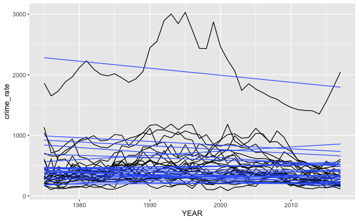
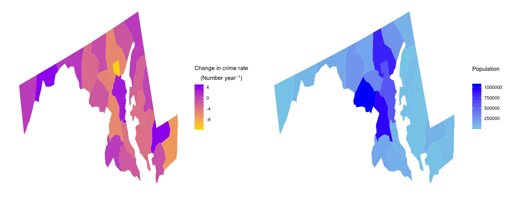

# Trends in Maryland Crime Rates: Project Overview 
- [x] Wrangled the raw data supplied by the State of Maryland. 
- [x] Analyzed the data using a hierarchical regression to examine both the statewide crime rate and crime rate for each Maryland county.
- [x] Plotted the changes in crime rates for each county.

## Code and Resources Used
- **Technology:** R
- **References:** The framework of the project was retrieved from [DataCamp](https://learn.datacamp.com/projects/673) which was maded by Richard Erickson.
- **Data Source:** Used the [crime statistics](http://goccp.maryland.gov/crime-statistics/) from the State of Maryland from 1975 to 2017.
- **Packages:** tidyverse, ggplot2, lmerTest, usmap.  

## EDA
There is a graph of the crime rate over time with linear trend lines grouped by counties.

## Model Building
In this dataset, a crime rate variable nested within counties. They, in turn, nested within year variable. These nested data represents a hierarchical multi-level relationship. Therefore, a simple linear regression model is not suitable for this type of data. To build a hierarchical multi-level model, we can use lmerTest package in R, which also known as a linear mixed-effects regression.

 
<code> lmer_crime <- lmer(crime_rate ~ YEAR_2 + (YEAR_2|JURISDICTION), crime_use) </code> 

  
## Model assessment
A p-value of the predictor variable is **0.0637**, which infers that we cannot reject the alternative hypothesis that a relationship between a crime rate and the year variable is statistically significant.

## Map visualization
Used usmap package to apply our results to the map of the Maryland state.

